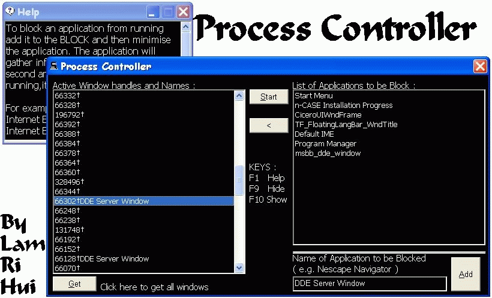



## Process Controller

### Description

Get all window application handler and window using api. Then, you can block the unwanted application handler and window. This code uses a timer to check whether the unwanted application is running or not. If the application is found running, this code will block the application from running immediately. Comments are welcomed. Please vote.
 
### More Info
 

             |
---                |---
**Submitted On**   |2003-09-27 01:00:24
**By**             |[Lam Ri Hui](https://github.com/Planet-Source-Code/PSCIndex/blob/master/ByAuthor/lam-ri-hui.md)
**Level**          |Beginner
**User Rating**    |5.0 (10 globes from 2 users)
**Compatibility**  |VB 4\.0 \(16\-bit\), VB 4\.0 \(32\-bit\), VB 6\.0
**Category**       |[Complete Applications](https://github.com/Planet-Source-Code/PSCIndex/blob/master/ByCategory/complete-applications__1-27.md)
**World**          |[Visual Basic](https://github.com/Planet-Source-Code/PSCIndex/blob/master/ByWorld/visual-basic.md)
**Archive File**   |[Process\_Co1650509262003\.zip](https://github.com/Planet-Source-Code/lam-ri-hui-process-controller__1-48806/archive/master.zip)

